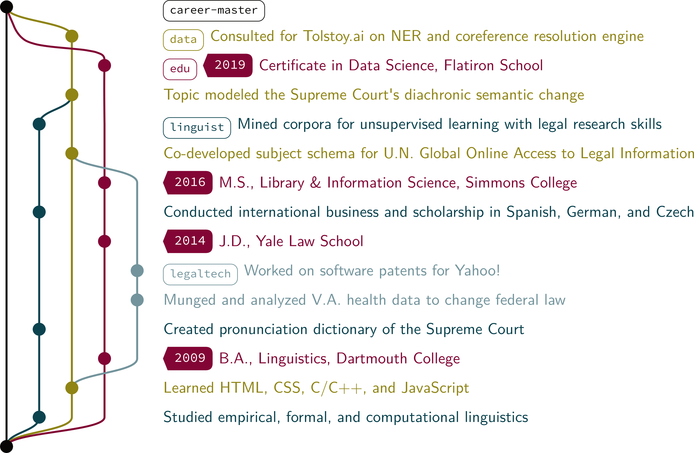
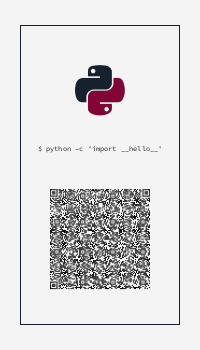

<h1 align="center">Welcome to ConTeXture 👋</h1>
<p>
  
  <a href="#" target="_blank">
    
  </a>
  <a href="https://twitter.com/lorarjohns" target="_blank">
    
  </a>
</p>

> A QR-code vcard LaTeX template to simplify your networking life

🚨 # **UNDER CONSTRUCTION** 🚨 

This repo's not done yet! But it's pretty cool anyway.

To-do:
- Add the Dockerfile.
- Include integration tests.
- Add the Makefile and CLI.
- Make example template folder.
- Create gifs for Inkscape.
- Quick and dirty FAQ for LaTeX packages

# ConTeXture

ConTeXture is a personal rebranding toolkit to help you look and feel snazzy. 
It generates a business card with a QR code that automatically imports your info to your 
new contacts' smartphones, and [still under development] provides resume templates 
that jazz up your job history.

* ConTeXture uses LaTeX for stunning **design** and powerful **function**
* It [optionally] uses **Docker** to install TeX and Inkscape in a virtual environment
* Its **command line interface** simplifies the hard parts
* Keep a git repo of your job history and generate beautiful documents with **bibTeX**
* If you {{:heart:}} braces, then get your fill of coding pretty things in **JavaScript**! :sparkles:



## Usage

There are a ton of easy resume generators out there, and I can print cards at Staples. Why bother with _LaTeX_?

* Career changers: you need to put experience in context (see, I made the pun work), and traditional templates are too rigid 
* Showcases your unique value with a flexible, customizable alternative format
* Stands out visually from the sea of resumes!
* Good for freelancers, people who've taken a hiatus, or others with a nonlinear job history


_what even is time_

* A QR code vcard is just _cool_.



_this is such a flex at conferences._

* Shows off your coding skills!

```latex

\node[below=2.5cm of pylogo.center]
  {\qrcode[level=M,height=\qrheight]{BEGIN:VCARD
VERSION:3.0
N:Lora;Johns;;Mx.
FN:Mx. Lora Johns
TITLE:Data Scientist
GENDER:None
TEL;TYPE=MOBILE:+000 000 0000
EMAIL:me@lorajohns.com
URL:https://lorajohns.com
NOTE:Professional skills: Python, pandas, numpy, scikit-learn, R, SQL, natural language processing, machine and deep learning, and DevOps, inter alia. Education: J.D. Yale; M.L.I.S. Simmons; B.A. Dartmouth (Linguistics); Data Science certificate, Flatiron School. Interests: To name a few, the intersection of language and math; ethical and introspective work in deep learning; circus arts; community leadership; and outdoorsmanship.
END:VCARD}};

```

* Who doesn't love arts and crafts?


_'graphic design is my passion' but seriously, art + code is very therapeutic._

## Languages, Packages and libraries

* LaTeX
* TeXshop (or TeXlive)
* pgf/tikz
* geometry
* fontawesome
* matrix, positioning, calc
* qrcode
* xcolor
* JavaScript, npm, node
* [gitgraph.js](http://gitgraphjs.com)


## Install

To-do: Still need to provide you with a nice Makefile for this, it's on the way.

```sh
$ git clone https://github.com/lorarjohns/ConTeXture.git
```

## How it works

1. Eventually, this will have a CLI tool, with presets for popular use cases.
2. The CLI tool will load a config file for you based on your inputs.
3. A Makefile will provide you with some commands for running 
4. A Makefile will provide you with some commands for running Docker and converting old-school PostScript and dvi files to printable images.
5. You'll have to provide your contact information and resume and create your own graphics. The sky's the limit. FYI, high contrast > low contrast.
6. Once you're satisfied, check your design against the printing templates (committing soon) to make sure that your design fits. (Double check with the print company before you pull the trigger; I disclaim responsibility for any business card-related tragedies.)
7. Upload your images to a printing service like [Moo](https://refer.moo.com/s/lorarjohns) or Staples.
8. Run the cleanup file to get rid of leftover Docker and TeX artifacts 

## Config

1. Make sure you have the requirements in the environment file installed. The LaTeX installation with LuaLaTeX or XeLaTeX, a vector graphic (or raster graphic) editor, and the necessary configuration can take a bit of time to set up. Make sure to submit any issues.
2. Install [FontAwesome](https://fontawesome.com/v4.7.0/icons/) if you want the icons as pictured on the front of the card. 
3. To render images from JavaScript files, you can use something like headless Chrome:

```bash
"/Applications/Google \Chrome.app/Contents/MacOS/Google \Chrome" --headless --screenshot --window-size=256,256 --default-background-color=0 index.html
```

Or, you can right-click on the image and save the SVG path from the source (and edit it in Inkscape if you're feeling fancy).

4. Make sure Docker is running if you're using the optional image

## Issues

Submit issues and questions [here](https://github.com/lorarjohns/ConTeXture/issues). 

* The Docker branch is not passing tests right now, so thanks for your patience!
* Resume templates will be up soon! 

## Extra goodies

If you want your business cards printed like they're art, I recommend [Moo](https://refer.moo.com/s/lorarjohns). I optimized the example template for their sizing,
and their cards came out great. I had excellent experiences with customer service adjusting the order and comping expedited shipping, too. If you are a business
of more than a few people, go to the [Moo for business link](https://refer.moo.com/s/lorarjohns14) instead.

## Author

👤 **Lora Johns**

* Twitter: [@lorarjohns](https://twitter.com/lorarjohns)
* Github: [@lorarjohns](https://github.com/lorarjohns)

_Inspired in part by [This repo](https://github.com/opieters/business-card)_

## Show your support

Give a ⭐️ if this project helped you!

<a href="https://www.patreon.com/lorarjohns">
  
</a>

***
_This README was generated with ❤️ by [readme-md-generator](https://github.com/kefranabg/readme-md-generator)_